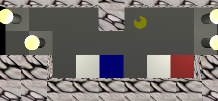
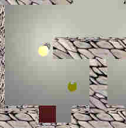
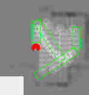
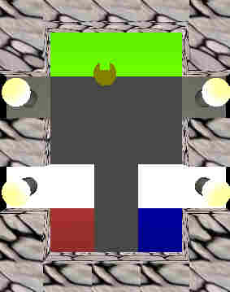
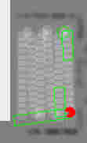
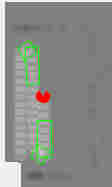
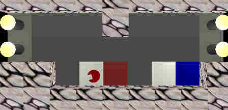
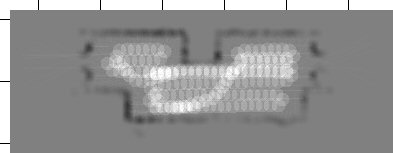

**Da der Maintainer nicht der Autor folgender Inhalte ist, welche bereits zuvor als freie Inhalte veröffentlicht worden sind, übernimmt er für diese keine Haftung und handelt gemäß der vorhandenen Lizenzbestimmungen (CC-BY-SA 4.0) für diese Inhalte nach bestem Wissen und Gewissen. Bei rechtlich bedenklichen Inhalten, die trotz Sichtung noch unentdeckt geblieben sind, bittet der Maintainer um eine kurze Benachrichtigung, damit diese umgehend entfernt werden können.**

# Beschreibung des Verhaltens bot_drive_area

Verhalten zum flächendeckenden Fahren und Explorieren (Start mit FB Taste 8)

Stand: 06.03.2009

## Verhaltensbeschreibung

Voraussetzungen: Aktive Map (mit on_the_fly Aktualisierung) und Positionsstack.

Das Verhalten ermöglicht dem Bot - ohne Kenntnis der Umwelt - eine flächendeckende Fahrweise. Er fährt hierbei solange geradeaus, bis er auf ein Hindernis trifft. Vorzugsweise dreht er sich dann nach rechts, um die rechte Nebenbahn abzufahren und merkt sich hierbei den noch unbefahrenen linken Weg auf dem Positionsstack. Während der Geradeausfahrt überwachen zwei Obserververhalten die beiden Nebenspuren und bei einem dort erkannten Hindernis laut Map wird die Strecke bis zum Hindernis auf dem Stack vermerkt.  Kommt der bot an einer Wand an und die Nebenbahnen sind entweder schon befahren oder wegen Hindernis nicht befahrbar, so nimmt er vom Stack die nächste abzufahrende Bahn und fährt zum Anfangspunkt dieser Bahn.

Die folgenden Bilder sollen das Verhalten verdeutlichen. Die gestrichelte Linie wurde vom Obserververhalten wegen Hinderniserkennung auf den Stack gelegt und für spätere Exploration vorgesehen:

  

## Algorithmus

Das Verhalten kann vereinfacht durch folgenden Algorithmus beschrieben werden:

 a. Geradeausfahren und benachbarte Bahnen beobachten, bis ein Hindernis im Weg ist
 a. Wenn Weiterfahrt in verschiedene Richtungen möglich ist, dann
  1. Lege zuerst die linke alternative Richtung auf den Stack (Anfangs- und Endpunkt)
  1. Speichern des rechten Weges auf den Stack; wegen letztem Stackeintrag wird rechter Weg hierdurch zur Vorzugsrichtung
 a. Wenn Weiterfahrt nur in eine Richtung möglich ist, Speichern des noch nicht befahrenen Weges auf dem Stack
 a. Wenn keine Weiterfahrt mehr möglich ist -> zu e)
 a. Holen nächsten Eintrag vom Stack
  1. Wenn kein Stackeintrag mehr vorhanden ist -> zu g)
  1. Fahre zum Startpunkt der vom Stack geholten Strecke
 a. Ausrichten auf den Endpunkt der zu befahrenen Strecke und weiter mit a)
 a. Verhaltensende – die komplette Fläche ist abgefahren

## Verhaltenshierarchie

### Geradeausfahren

* Wenn bereits ein Hindernis voraus gesehen wird, dann nur bis dorthin fahren via bot_goto_dist().
* Sonst fahren mittels bot_goto_obstacle().
* Überwachung des Fahrens auf Hindernis und Abgrund erfolgt via bot_cancel_behaviour().
* Während der Vorwärtsfahrt sind die Observer-Unterverhalten (bot_observe_right_behaviour und bot_observe_left_behaviour) aktiv, die jeweils die rechte und linke Nebenbahn auf Hindernisse oder schon befahrene Bahnen überwachen. Wird ein Hindernis auf einer Nebenbahn laut Map erkannt, wird die Strecke bis dorthin auf dem Stack für spätere Exploration vermerkt.

### Anfahren der nächsten Strecke

An einem Hindernis angekommen, wird die nächste Strecke vom Stack geholt und sich zum Startpunkt, der zum Bot am Nahesten ist, mittels bot_turn_behaviour ausgerichtet. Via bot_goto_dist() wird nun dorthin gefahren und dies wiederum überwacht (Abgrunderkennung) mittels bot_cancel_behaviour. Am Startpunkt der anzufahrenden Strecke angekommen, wird sich nun zum Endpunkt der Strecke mittels bot_turn() ausgerichtet und es geht wieder mit Geradeausfahren weiter.

## Exploration von Beispiel-Labyrinthen

### testparcours2.xml

Der Bot fährt zuerst hoch bis zur Lampe, merkt sich die linke Bahn im Stack für später, dreht sich nun zur rechten Spur, um diese wieder nach unten abzufahren. Hat er so die ganze Fläche bis zur rechten Wand befahren, fährt er nun zur linken Bahn, welche zu Beginn an der Lampe ankommend auf den Stack gelegt wurde.

Die folgenden Bilder zeigen diese Exploration:

   

Das vollständige Abfahren der gesamten Fläche von Testlabyrinths zeigen die folgenden Bilder:
   

  

## ToDo und Optimierungen

* Pfadplanung auf nur befahrenem Gebiet:

  Wenn es nach Abfahren einer Strecke keinen unbefahrenen Weg mehr daneben gibt, so wird ja die nächste unbefahrene Strecke vom Stack geholt. Bei komplexen Labyrinthen kann der direkte Weg dorthin aber mit Hindernissen verstellt sein. Hier wäre eine Pfadplanung wünschenswert, die den Bot auf nur bereits exploriertem Gebiet den Weg dorthin weist, um unbefahrenes Gebiet nicht zu zerstückeln. Es werden ja nur unbefahrene Strecken auf den Steck vermerkt.

* Echter Trackfolger, der sich an der Nebenbahn laut Map immer wieder in entsprechendem Abstand ausrichtet:

  Aktuell wird nur der Startpunkt einer zu explorierenden Bahn angefahren, sich zum Endpunkt ausgerichtet und einfach geradeaus gefahren. Im Sim ist dies recht optimal und die Bahnen verlaufen parallel zueinander. Der echte Bot wird aber nie genau geradeausfahren können, so dass die Bahnen auch nie gerade verlaufen. Wenn dann die Nebenbahn befahren wird, müßte immer wieder der Abstand zur vorher befahrenen Nebenbahn gecheckt und korriegiert werden. Nur so wäre das Geradeausfahren ein echter Trackfolger.

* Bei keiner Wegefreiheit beim Vorwärtsfahren laut Map die Strecke nicht gleich verwerfen, sondern vorn in den Stack wieder einschieben mit Zähler, wie oft schon verworfen wurde und erst nach x-Versuchen verwerfen:

  Eine Strecke sollte möglichst nicht verworfen werden, weil sich möglicherweise nur durch das Befahren dieser Strecke ein komplettes weiteres Gebiet eröffnet, welches sonst unerforscht bleibt (Türdurchfahrt). Hier kann nach dem Stackholen und Anfahren einer nicht direkt erreichbaren Strecke die Pfadplanung helfen. Aber gerade bei einer noch nicht vollständig kartierten Umgebung kann eine befahrene Strecke plötzlich mit Hindernis versehen sein und hier sollte sich dann eine mögliche Reststrecke auch wieder gemerkt werden.

* Wandfolger zum Anfahren des Startpunktes der nächsten Strecke, da sonst immer kleine Gebiete an der Wand unerforscht stehenbleiben (Treppenabsätze).

Autor: Frank Menzel
