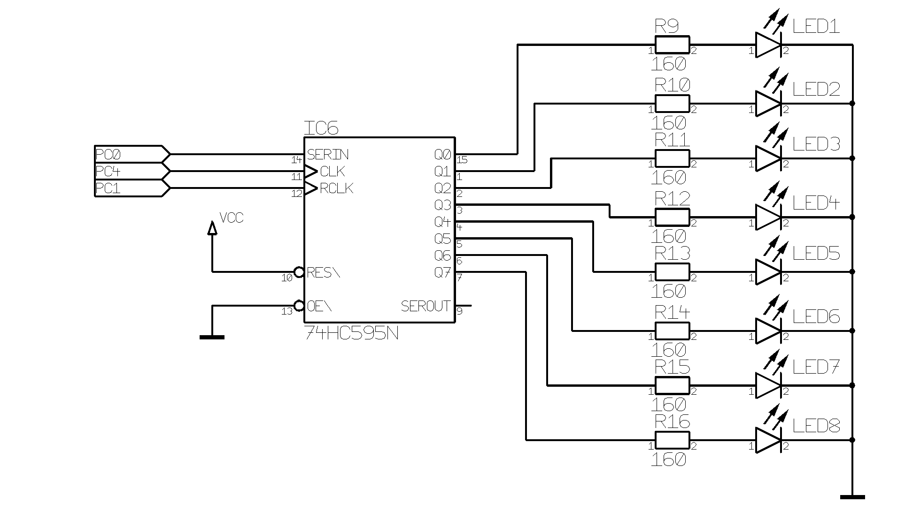
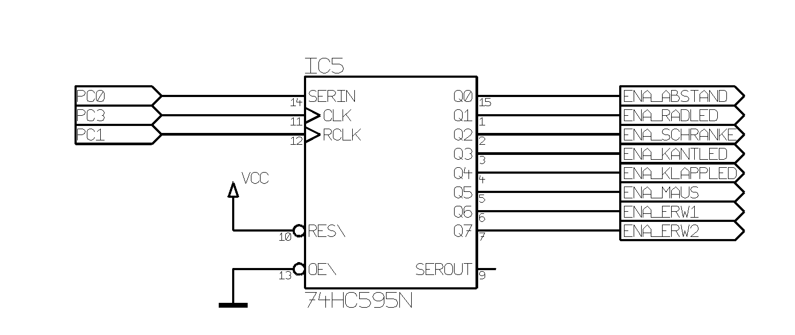
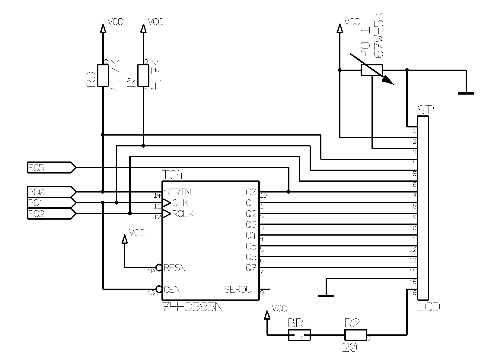
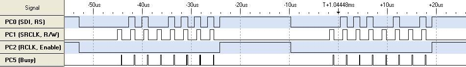
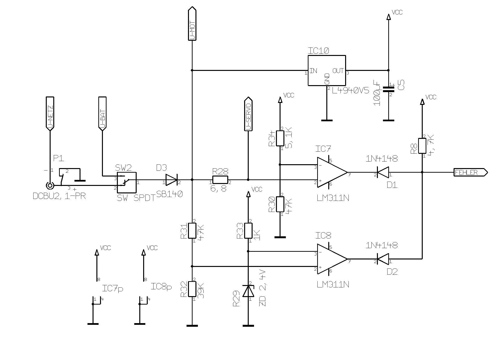

# Die Elektronik des c't-Bot

## Elektronische Bauteile

### AVR-Mikrocontroller

'''AVR''' ist eine 8-Bit-RISC-Mikrorozessor-Familie des Halbleiter-Herstellers Microchip.
Bis zur Übernahme durch Microchip wurde das zugehörige Produktspektrum vom Chip-Hersteller Atmel geführt.
Ähnlich wie die Produktserie der PIC-Mikrocontroller von Microchip erfreut sich auch die AVR-Familie einer großen Beliebtheit, die auch weit in den Hobby- und semi-professionellen Bereich hinein reicht.

Die AVR-Produktrange unterteilt sich in die folgenden Produktlinien:

| Produktlinie      | Einführung  | Architektur | Bemerkungen                                        | Status |
| ---               | ---         | ---         | ---                                                | ---    |
| AT90Sxxxx         | 1996        | avr         | "Classic Line" (CL)                                | EOL    |
| ATtiny            | 1996        | avr         | Low-Power/Low-Performance Line                     |        |
| ATmega            | 1999        | avr         | Hauptlinie                                         |        |
| AT90yyyxxx        | 2006        | avr         | Revision der CL für CAN-, USB- und PWM-Anwendungen |        |
| ATxmega           | 2008        | avrxmega    | neuer interner Aufbau, 8/16-bit                    |        |
| ATtiny 0-/1-Serie | 2018 / 2016 | avrxmega    | 2. Generation der Low-Power/Low-Performance Line   |        |

EOL: End-of-Life (obsolet)

Hinweis: Die Architekturen avrxmega und avr sind nicht zueinander kompatibel!

Die große Beliebtheit der AVRs ergibt sich u.a. aus ihrer einfachen Handhabung.
Fast alle Typen können über eine sogenannte ISP-Schnittstelle (AVR ISP) programmiert werden.
Bei einem solchen In-System Programmer handelt es sich um einen Programmieradapter welcher an die serielle, parallele oder USB-Schnittstelle eines PCs angeschlossen wird.
Die Besonderheit liegt hierbei in der Möglichkeit, den Mikrocontroller nicht aus der Zielschaltung herausnehmen zu müssen, um ihn zu programmieren.
Neuere Controller-Typen besitzen darüber hinaus noch eine JTAG-Schnittstelle, über die man den IC-Baustein nach dem IEEE-Standard 1149.1 debuggen kann.

### RISC-Architektur

RISC ist eine Abkürzung für ""''R''educed ''I''nstruction ''S''et ''C''omputing" und beschreibt eine Prozessor-Architektur. Übersetzt bedeutet dies in etwa "Rechnen mit reduziertem Befehlssatz". Beispiele für RISC-Prozessoren sind Microchip AVR sowie MIPS.
Ein Vorteil gegenüber anderen Mikroprozessor-Familien ist, dass sich dank der RISC-Architektur die meisten Befehle auf Registern innerhalb eines Systemtakts abarbeiten lassen, was in einer höhere Rechengeschwindigkeit gegenüber anderen Architekturen resultiert.
Hiervon ausgenommen sind Sprung- und Multiplikationsbefehle, sowie Zugriffe auf das Speicherinterface (u.a. RAM und I/O-Ports).

Durch das auf Hochsprachen wie C ausgelegte Hardware-Design können auch Compiler sehr effizienten Code erzeugen, sodass man sich hierfür nicht mehr unbedingt auf Assembler-Ebene begeben muss.

### Befehlssatz

Im Gegensatz zu den PICmicro-Mikrocontrollern wurde der AVR-Befehlssatz, abgesehen von wenigen Ausnahmen wie beispielsweise dem AT90S1200 mit eingeschränktem und der ATmega-Serie mit erweitertem Befehlssatz, weitestgehend über alle Modelle kompatibel gehalten.

| Modell               | Anzahl der Befehle |
| ---                  | ---                |
| AT90S1200            | 52                 |
| AT90xxxx ("Classic") | 62                 |
| ATtiny               | bis 123            |
| ATMega               | 130 - 135          |
| ATxmega              | ab 142             |

Die AVR-Prozessoren sind für die effiziente Ausführung von kompiliertem C-Code konzipiert worden.
Um Optimierungspotentiale zu erkennen, wurde noch vor Fertigstellung des AVR-Kerns wurde mit der Entwicklung eines C-Compilers begonnen.

----

So wurde die Instruktion "Addition mit direktem Parameter" (''add immediate'') entfernt, denn anstatt dieser Instruktion kann ebenso gut der Befehl "Subtrahiere direkt" (''subtract immediate'') mit dem Komplement verwendet werden.
Der dadurch auf dem Silizium frei werdende Platz wurde dann zum Realisieren einer "Addition mit direktem 16-Bit-Parameter" (''add immediate word'') frei.
Ein Befehl wie "Vergleich mit Carry-Flag" (''compare with carry'') wurde eingeführt, um einen effizienten Vergleich von 16- und 32-Bit-Werten, wie er in Hochsprachen an der Tagesordnung ist, zu ermöglichen.
Anstatt zwei Adressregistern wurden drei Adressregister vorgesehen, und auf ein anfangs geplantes segmentiertes Speicher-Layout wurde komplett verzichtet, weil dieses nur schwer von Compilern zu handhaben ist.

== Speicherarchitektur ==

Das Speicher-Management folgt den Richtlinien der Harvard-Architektur.
Es gibt also getrennte Adressräume für den Flash-Speicher, das RAM und das EEPROM.
Im Gegensatz zu einfacheren Microkontrollern besitzen die AVRs 32 Register, mit welchen direkt Operationen ausgeführt werden können.
Ein umständliches Verschieben von Werten aus dem RAM, um dann mit ihnen Operationen durchführen zu können, entfällt hiermit.

Weiterhin existiert eine Vielzahl freier Entwicklungswerkzeuge, wie z.B. die für AVR-Cross-Compiling portierten GNU-Tools.

== Weblinks ==

* [https://www.mikrocontroller.net/articles/AVR Mikrocontroller.net Artikelsammlung - AVR]

* [http://www.nongnu.org/avr-libc/ AVR-Port der C-Standardbibliothek]
* [http://winavr.sourceforge.net/ GNU C/C++-Cross-Compiler (Windowsversion)]
* [http://cdk4avr.sourceforge.net/ GNU C/C++-Cross-Compiler (Linuxversion)]
* [http://www.e-lab.de/ AVRco Embedded Pascal Compiler (Windows)]

Autoren: Lomdar67

#### ATmega 32

== Einleitung ==

Der ATmega32 Mikrocontroller ist ein 8-Bit [[Glossar#RISC|RISC]] Mikrocontroller aus der [[Glossar#AVR|AVR]] Serie der Firma [http://www.atmel.com Atmel] und bildet das Herzstück der Steuerung des c't-Bots. Mit seinen 32 Ein-und Ausgängen und 32kByte Flash Speicher ist er derzeit der leistungsfähigste Prozessor aus der AVR Reihe, der noch im Standard-DIL Gehäuse verfügbar ist.
Falls der Speicher einmal knapp werden sollte, kann als pin-kompatibler Mikrocontroller auch der ATmega644, ATmega644P oder ATmega1284P eingesetzt werden. Dieser wird vom Programmcode bereits voll unterstützt. Es müssen dazu lediglich ein paar Einstellungen im Projekt geändert werden.

Trotz der relativ großen Anzahl von Ports sind alle seine Ports belegt. Deshalb werden über Schieberegister noch drei 8-Bit [[Erweiterungsport_Belegung|Porterweiterungen]] angebunden. Dort sind die LEDs und die Enable Leitungen für die einzelnen Baugruppen angebunden. Über den dritten Erweiterungsport kann optional ein [[LCD-Modul]] angeschlossen werden.

Vom Steuer-Programm werden die Sensoren abgefragt und die Aktoren (Motoren, LEDs, Servos) eingestellt. Außerdem kümmert er sich noch um die Kommunikation mit dem PC oder anderen c't-Bots.

Falls der Speicher einmal knapp werden sollte, könnte als pin-kompatibler Mikrocontroller auch der [[Atmel_ATmega644|ATmega644]] eingesetzt werden. Dieser ist seit Ende 2006 auch verfügbar.

== Schaltbild ==

[[Bild:mikrocontroller_schem.png|800px|Schaltbild Mikrocontroller]]

=== Features ===

Die wichtigsten Eigenschaften des ATmega32 im Überblick:

* 32kByte internes Flash-Memory, mindestens 10000 Schreib/Lösch Zyklen
* 1024 Byte EEPROM, mindestens 100000 Schreib/Lösch Zyklen
* 2048 Byte SRAM
* bis zu 32 programmierbare I/O Ports
* 8 10-bit AD-Wandler
* 1 Analog Komparator
* USART, JTAG, ISP, SPI und I2C(TWI) Schnittstelle
* 2 8-bit und 1 16-bit Timer
* 4 PWM Ausgänge
* 16 MIPS bei 16MHz Takt

==== Erläuterungen: ====
'''I2C''': Ein von Philips entwickelter serieller Kommunikationsbus. I2C wird "''I-Quadrat-C''" bzw. "''I-square-C''" ausgesprochen und bedeuted "'''''I'''nter-'''I'''ntegrated '''C'''ircuit''". Der I2C Bus ist ein 2-Draht-Bus, d.h. es werden lediglich 2 Prozessor Ports benötigt, SDA (Data) und SCL (Clock). Der  maximale Datentakt beträgt 100kHz im Standard Mode, bzw. 400kHz im Fast Mode. Der AVR unterstützt I2C per Hardware durch sein TWI-Interface. TWI bedeutet "'''''T'''wo '''W'''ire '''I'''nterface''" und ist die Bezeichnung von Atmel für I2C.

'''SPI''': Ein von der Firma [http://www.motorola.com Motorola] entwickleter synchroner serieller Bus. SPI ist eine Abkürzung für ''"'''S'''erial '''P'''eripheral '''I'''nterface"''. Es werden mind. 3 Ports benötigt, SDO (Data Out) bzw MOSI, SDI (Data In) bzw. MISO und SCLK (Datentakt) und ggf. ein oder mehrere Chip Select Signale.

=== Pin Belegung ===

{|
|[[Bild:atmega32.jpg|framed|ATmega32 Pinbelegung  Quelle: [http://www.atmel.com Atmel]]]
|}

{|
|'''Port'''
|'''Pin'''
|'''I/O'''
|'''Funktion'''
|'''Anmerkung'''
|-
|PB0
|1
|XCK/T0
|SCHRANKE
|[[Lichtschranke_und_Klappensensor|Lichtschranke]]  (IS471F)
|-
|PB1
|2
|T1
|FERNBED
|Fernbedienung Infrarot Empfänger
|-
|PB2
|3
|INT2/AIN0
|FEHLER
|Spannungsüberwachung
|-
|PB3
|4
|OC0/AIN1
|PWM0
|Geschwindigkeit, Richtung Servo 1 (Pulsweitenmodulation, PWM)
|-
|PB4
|5
|/SS
|RADL
|[[Radencoder]] links (Odometrie) ([[CNY70]])
|-
|PB5
|6
|MOSI
|MOSI
|ISP, Maussensor
|-
|PB6
|7
|MISO
|MISO
|ISP, Maussensor
|-
|PB7
|8
|SCK
|SCLK
|ISP, Maussensor
|-
|PD0
|14
|RXD
|RXD
|[[Glossar#UART|UART]] Empfänger
|-
|PD1
|15
|TXD
|TXD
|[[Glossar#UART|UART]] Sender
|-
|PD2
|16
|INT0
|CTS
|[[Glossar#UART|UART]] Clear to Send
|-
|PD3
|17
|INT1
|RADR
|[[Radencoder]] rechts (Odometrie) ([[CNY70]])
|-
|PD4
|18
|OC1B
|PWM1B
|Geschwindigkeit Motor L (Pulsweitenmodulation, PWM)
|-
|PD5
|19
|OC1A
|PWM1A
|Geschwindigkeit Motor R (Pulsweitenmodulation, PWM)
|-
|PD6
|20
|ICP1
|KLAPPE
|[[Lichtschranke_und_Klappensensor|Klappensensor]]
|-
|PD7
|21
|OC2
|PWM2
|Geschwindigkeit, Richtung Servo 2 (Pulsweitenmodulation PWM)
|-
|PA0
|40
|ADC0
|ABSTL
|[[Distanzsensoren|Distanzsensor]] links (GP2D12)
|-
|PA1
|39
|ADC1
|ABSTR
|[[Distanzsensoren|Distanzsensor]] rechts (GP2D12)
|-
|PA2
|38
|ADC2
|MLINKS
|[[Liniensensor]] links ([[CNY70]])
|-
|PA3
|37
|ADC3
|MRECHTS
|[[Liniensensor]] rechts ([[CNY70]])
|-
|PA4
|36
|ADC4
|LDRL
|[[Lichtsensor]] links
|-
|PA5
|35
|ADC5
|LDRR
|[[Lichtsensor]] rechts
|-
|PA6
|34
|ADC6
|KANTEL
|[[Absturzdetektor]] links ([[CNY70]])
|-
|PA7
|33
|ADC7
|KANTER
|[[Absturzdetektor]] rechts ([[CNY70]])
|-
|PC0
|22
|SCL
|PC0
|[[Erweiterungsport_Belegung|LED-, LCD-, Enable- Port]]
|-
|PC1
|23
|SDA
|PC1
|[[Erweiterungsport_Belegung|LED-, LCD-, Enable- Port]]
|-
|PC2
|24
|TCK
|PC2
|[[Erweiterungsport_Belegung#LCD_Port|LCD Port]]
|-
|PC3
|25
|TMS
|PC3
|[[Erweiterungsport_Belegung#Enable_Port|Enable Port]]
|-
|PC4
|26
|TDO
|PC4
|[[Erweiterungsport_Belegung#LED_Port|LED Port]]
|-
|PC5
|27
|TDI
|PC5
|[[Erweiterungsport_Belegung#LCD_Port|LCD Port]]
|-
|PC6
|28
|TOSC1
|PC6
|Richtung Motor L
|-
|PC7
|29
|TOSC2
|PC7
|Richtung Motor R
|}

== Weblinks ==

* [http://www.roboternetz.de/wissen/index.php/ATMega32 Roboternetz Wissen - ATmega32]

Autoren: Noxon, Mkosch

#### ATmega 644/644P

== Einleitung ==

Der ATmega644 Mikrocontroller ist ein neuerer 8-Bit [[Glossar#RISC|RISC]] Mikrocontroller aus der [[Glossar#AVR|AVR]] Serie der Firma [http://www.atmel.com Atmel]. Er ist pinkompatibel zum [[Atmel_ATmega32|ATmega32]] und kann deshalb als Ersatztyp für diesen auf dem c't-Bot eingesetzt werden.
Hauptunterschied zu diesem sind der doppelte Speicher und interrupt-fähige I/O Ports.

Der ATmega644 ist mittlerweile auch in Deutschland lieferbar z.B. bei [http://www.reichelt.de Reichelt] (Stand Dez 2006).

== Features ==

Die wichtigsten Eigenschaften im Überblick:

* '''64kByte internes Flash-Memory''', bis zu 10000 Schreib-/Lösch-Zyklen
* '''2048 Byte EEPROM''', bis zu 100000 Schreib-/Lösch-Zyklen
* '''4096 Byte SRAM'''
* bis zu 32 programmierbare I/O Ports, '''interruptfähig'''
* 8 10-bit-AD-Wandler
* 1 Analogkomparator
* USART, JTAG, ISP, SPI und I2C(TWI)-Schnittstelle
* 2 8-bit und 1 16-bit-Timer
* '''6 PWM Ausgänge'''
* '''20 MIPS bei 20MHz Takt'''

Unterschiede gegenüber dem [[Atmel_ATmega32]] sind '''fettgedruckt'''.

== Projekt Einstellungen für den mega644 ==

Für den mega644 müssen im Eclipse Projekt die Einstellungen für die Ziel CPU von '''mmcu=mega32''' auf '''mmcu=mega644''' geändert werden. Das muß zweimal gemacht werden. Sowohl für den Compiler als auch für den Linker.

[[Bild:gcc-compiler-mega644.jpg]]

[[Bild:gcc-linker-mega644.jpg]]

Autoren: Lomdar67, Marvin

----

### Feldeffekt-Transistor

FET ist eine Abkürzung für "Field Effect Transistor", also Feldeffekt-Transistor.
Es handelt sich hierbei um einen unipolaren Transistor.
Beim c't-Bot werden mehrere BS250 P-Kanal FETs zum Einschalten (enable) bzw. Ausschalten (disable) von Schaltungsteilen eingesetzt.

### Motortreiber L293D

----

Der Antrieb des c't-Bot wird von zwei DC-Getriebemotoren der Firma [http://www.faulhaber.com Faulhaber] gebildet.
Da der [[Mikrocontroller]] diese Motoren nicht direkt betreiben kann, wird ein sogenannter Motor Treiber benötigt.
Das ist in diesem Falle der L293D.

Der L293D IC beinhaltet 4 Halb-H-Brücken Treiber und ist ein gängiger Motortreiber-IC für 2 Getriebemotoren bzw. einen Schrittmotor. Damit lassen sich 2 DC-Motoren bidirektional betreiben (als 2-fach H-Brücke), oder 1 Schrittmotor birektional. Die Belastbarkeit pro Halbbrücke beträgt 600mA. Der L293D beinhaltet im Gegensatz zum pin-kompatiblen L293 und dem großen Bruder L298 die interne Freilaufdioden. Diesen schützen den IC vor den, vom Motor ausgehenden, Spannungsspitzen.

Angesteuert wird der L293D durch 4 Eingangssignale des [[Mikrocontroller]].

=== Drehrichtung & Geschwindigkeit ===

Die beiden Eingangssignale PC6 und PC7 bestimmen die Richtung, in die die Motoren laufen.
Das einzelne Richtungs-Signal vom [[Mikrocontroller]] wird dazu über ein invertierende Gatter dem L293D zugeführt.

Die beiden Eingangssignale PWM1A und PWM1B bestimmen die Geschwindigkeit, mit der die Motoren laufen.
Am Enable Eingang des L293D liegt ein sogenanntes Pulsweitenmoduliertes (PWM) Signal. Dieses PWM Signal kann der Mikrocontroller mithilfe seiner Timer selbsttätig erzeugen. Vom Programm her muss nur noch das Verhältnis zwischen Signal und Signalpause geändert werden. Damit wird die Geschwindigkeit des Motors geregelt.

== Schaltbild ==

[[Bild:l293d_schem2.png|800px|Schaltbild Motortreiber]]

'''Achtung:''' Nach Einschalten des c't-Bots, bzw. während Reset (z.B. beim Flashen), drehen beide Motoren mit voller Kraft, und der Bot dreht sich im Kreis. Das liegt daran, das während der Bootphase und solange das Reset Signal auf Low liegt, alle Ports des Mikrocontrollers auf Input geschaltet sind. Deshalb liegen auch die beiden Enable Ports am Motortreiber auf HIGH Pegel, und damit drehen die Motoren. Abhilfe schafft hier ein [http://www.ctbot.de/forum/motor-treiber-patch-t197.html Hardware Patch]. Dabei werden die beiden Enable Ports mit Pulldown Widerständen nach LOW gezogen. Damit bleiben die Motoren während der Bootphase bzw. bei Reset aus.

=== Features ===

* Großer Spannungsbereich von 4,5..36V
* serarate Eingangs-Logik Spannungsversorgung (z.B. TTL Pegel kompatibel)
* Interner ESD Schutz
* automatische Abschaltung bei Übertemperatur
* Ausgangsstrom 500mA pro Kanal
* kurzeitige Spitzen Strom bis zu 1,2A je Kanal
* integrierte Freilaufdioden
* Nachteil: Hohe Ruhestromaufnahme (>50mA)

=== Pin Belegung & Blockdiagramm ===

{|
|[[Bild:l293d_pinout.jpg|framed|L293 Pinbelegung  Quelle: [http://www.ti.com Texas Instruments]]]
|[[Bild:l293d_blck.jpg|framed|L293 Block Diagramm  Quelle: [http://www.ti.com Texas Instruments]]]
|}

== Weblinks ==

* [http://www.ctbot.de/viewtopic.php?&t=197 c't-Bot Forum] - Hardware Patch für den Motortreiber
* [http://www.roboternetz.de/wissen/index.php/Getriebemotoren_Ansteuerung Roboternetz Wissen - Getriebemotoren Ansteuerung]

Autor: Marvin

----

## Schnittstellen

### I/O-Erweiterung

Die I/O-Erweiterung wird beim c't-Bot durch drei Schieberegister vom Typ 74HC595 (Seriell-Parallel-Wandler) realisiert.
Synchron zu einem Taktsignal werden die Daten seriell vom Prozessor in das Schieberegister übertragen.
Nach Übertragung von 8 Bit kann das Signal dann am 8-Bit Parallel-Ausgangsport ausgegeben werden.
Während der Übertragung bleiben die Ausgangssignale durch den Ausgangslatch des 74HC595 stabil.

Zur Ansteuerung der drei Schieberegister werden insgesamt fünf Mikrocontroller-Pins benötigt.

| Pin | Funktion                      |
| --- | ---                           |
| PC0 | Serielle Daten                |
| PC1 | Takt für Storage Register (LED & ENA) bzw. Shift Register (LCD) |
| PC2 | Takt für Storage Register LCD |
| PC3 | Takt für Shift Register ENA   |
| PC4 | Takt für Shift Register LED   |

#### LEDs

Auf dem c't-Bot befinden sich insgesamt 8 LEDs, die als Statusanzeigen dienen können.
Die serielle Datenübertragung in das Schieberegister via Pin _PC0_ erfolgt synchron zum Takt von _PC4_.

##### Portbelegung

| Port | Bezeichnung | Funktion           |
| ---  | ---         | ---                |
| Q0   | LED1        | blau, vorne links  |
| Q1   | LED2        | blau, vorne rechts |
| Q2   | LED3        | rot                |
| Q3   | LED4        | orange             |
| Q4   | LED5        | gelb               |
| Q5   | LED6        | grün               |
| Q6   | LED7        | blau               |
| Q7   | LED8        | weiß               |

##### Schaltbild

#### Enable-Signale

Über die Enable-Signale können einzelne Baugruppen (Sensoren) des c't-Bots ein- oder ausgeschaltet werden.
Durch das selektive Aktivieren von Baugruppen nach Bedarf lässt sich der Energieverbrauch des Roboters optimieren.
Die serielle Datenübertragung in das Schieberegister via Pin _PC0_ erfolgt synchron zum Takt von _PC3_.

##### Portbelegung

| Port | Bezeichnung      | Funktion                                                                                                 |
| ---  | ---              | ---                                                                                                      |
| Q0   | ENA_ABSTAND      | Enable der Distanzsensoren (GP2D12)                                                                          |
| Q1   | ENA_RADLED       | Enable der integrierten IR-LEDs in den Radencodern (CNY70)                                               |
| Q2   | ENA_SCHRANKE     | Enable der Lichtschranke (IS471F)                                                                            |
| Q3   | ENA_KANTLED      | Enable der integrierten IR-LEDs in den Kantensensoren (CNY70)                                            |
| Q4   | ENA_KLAPPLED     | Enable der integrierten IR-LED im Klappensensor (CNY70) und der IR-LED für die Lichtschranke im Transportfach |
| Q5   | ENA_LINE         | Enable der integrierten IR-LEDs in den Liniensensoren (CNY70)                                            |
| Q6   | ENA_MMC          | Enable Erweiterung 1 oder Chip-Select für MMC, falls Erweiterungsboard vorhanden                         |
| Q7   | ENA_MOUSE_SENSOR | Enable Erweiterung 2 oder Chip-Select für Maussensor, falls Erweiterungsboard vorhanden                  |

##### Schaltbild

#### LCD

Der c't-Bot lässt sich mit einem [LC-Display](ct-bot_display.md) erweitern.
Die serielle Datenübertragung in das Schieberegister via Pin _PC0_ erfolgt synchron zum Takt von _PC1_.

##### Portbelegung

| Port | Funktion       |
| ---  | ---            |
| Q0   | Datenbus Bit 0 |
| Q1   | Datenbus Bit 1 |
| Q2   | Datenbus Bit 2 |
| Q3   | Datenbus Bit 3 |
| Q4   | Datenbus Bit 4 |
| Q5   | Datenbus Bit 5 |
| Q6   | Datenbus Bit 6 |
| Q7   | Datenbus Bit 7 |

Das LCD-Modul selbst wird über einen 16-poligen (2x8) Wannenstecker (ST4) angeschlossen.
Die Belegung entspricht dem üblichen Standard der meisten LCD-Module.
Über einen Jumper (BR1) kann man die Hintergrundbeleuchtung ein- bzw. ausschalten.

##### Steckerbelegung ST4

| Pin | Bezeichnung | Beschreibung                                                                              |
| --- | ---         | ---                                                                                       |
|   1 | GND         | Masse                                                                                     |
|   2 | VCC         | Spannungsversorgung +5V                                                                   |
|   3 | VEE         | Displayspannung (Kontrast) 0 ... 1,5V                                                     |
|   4 | RS          | Register Select: 0 = Kommando senden; 1 = Daten schreiben                                 |
|   5 | R/W         | Auswahl Lese-/Schreibmodus: 0 = Daten schreiben; 1 = Daten lesen                          |
|   6 | Enable      | Steigende Flanke: Einlesen von RS und R/W. Fallende Flanke: Einlesen / Schreiben Datenbus |
|   7 | DB0         | Datenbus Bit 0 LSB                                                                        |
|   8 | DB1         | Datenbus Bit 1                                                                            |
|   9 | DB2         | Datenbus Bit 2                                                                            |
|  10 | DB3         | Datenbus Bit 3                                                                            |
|  11 | DB4         | Datenbus Bit 4                                                                            |
|  12 | DB5         | Datenbus Bit 5                                                                            |
|  13 | DB6         | Datenbus Bit 6                                                                            |
|  14 | DB7         | Datenbus Bit 7 MSB                                                                        |
|  15 | GND         | Masse Hintergrundbeleuchtung                                                              |
|  16 | VCC         | Spannungsversorgung Hintergrundbeleuchtung (interner Vorwiderstand vorhanden)             |

##### Schaltbild

#### Signalverlauf

**Achtung:** Im Schaltplan der Hauptplatine befindet sich ein Fehler.
Der Pin _PC5_ sollte eigentlich das Busy-Flag des LCD-Moduls abfragen.
Dieses liegt aber LCD-seitig an _DB7_ (MSB) an und nicht an _DB0_ (LSB), weshalb eine Abfrage des Busy-Flags nicht möglich ist.
Der c't-Bot-Code verzichtet aber ohnehin auf dieses Signal und arbeitet stattdessen mit Delays.

## Stromversorgung

----

Für die Stromversorgung des ct-bot sind zwei über SW2 wählbare Alternativen vorgesehen:

'''A:''' POWER1 (U-Bat): '''Akkupack 5x1,2V''' Mignon Akku (AA), eingespeist über Stiftleiste ST1. Marktübliche Kapazität z.Zt.(2/06) max. ca. 2,5Ah. (Bei '''Bestückung mit Batterien''' sollte die '''Anzahl auf 4 begrenzt''' werden, max 6,25V!) [http://www.ctbot.de/index.php?page=5&smartor_mode=album_showpage&pic_id=141 Batteriehalter]; [http://www.ctbot.de/index.php?page=5&smartor_mode=album_showpage&pic_id=28 Batteriehalter Montage]

'''B:''' POWER2 (U-Netz): '''Netzteil 6V Gleichspannung''', eingespeist über DCBU2, 1-PR (der in der Buchse integrierte Schalter bleibt als Akku/Netzteil-Umschalter ungenutzt, statt dessen hat ct, unnötigerweise als zusätzliches  Bauteil, den Umschalter SW2 vorgesehen).
Der Minuspol beider Quellen ist auf die gemeinsame Masse gelegt, der Pluspol über den Versorgungswechsler SW SPDT und die Verpolschutzdiode D3 an folgende Komponenten:

* zur '''Versorgung mit geregelten 5V,  maximal 1,5A Belastbarkeit''', an den '''Low Drop Spannungswandler''' [http://www.st.com/stonline/products/literature/ds/2141/l4940xx5.pdf L4940V5], dessen Ausgang über C5 mit 100μF(25V) geblockt ist und danach für Prozessor und die gesamte Glue-Logik verwendet wird.
'''Achtung Patch!!!''' Bei sporadischen, unerwarteten Resets hat sich bei einigen Usern hier ein [http://www.ctbot.de/index.php?page=5&smartor_mode=album_showpage&pic_id=138[ein 100nF Kondensator parallel zu C5 bewährt.]
* '''Leistungseingang der Motortreiber''' [http://www.st.com/stonline/books/pdf/docs/1330.pdf L293D]
* '''J3 für Erweiterungskomponenten''' (diesen stehen, an Pin2, sowohl die ungeregelte 6V-Versorgung als auch, an Pin1, die geregelten 5V zur Verfügung).
* zum '''Schutz vor Tiefentladung''', über Spannungsteiler R31/R32, an den nicht invertierenden Komparatoreingang eines LM311, der sie mit der Zenerspannung von 2,4V vergleicht und bei Unterschreiten ein Fehlersignal auslöst. Dies entspricht einem Unterschreiten der Akku- oder Netzteilspannung von ca. 5,5 bis 5,6V.
* als '''Versorgung der Servos''', über R28, jeweils an Pin 1 von J1+J2 .
* und, zur '''Indikation einer klemmenden Transportklappe''', ebenfalls über R28 an den nicht invertierenden Komparatoreingang eines weiteren LM311. Dieser vergleicht die, um den Spannungsabfall an R28 reduzierte, Versorgungsspannung mit der, über Spannungsteiler R34/R30 anliegenden, Referenzspannung von 4,5V und löst bei Unterschreiten ebenfalls einen Fehler aus.

Zu 5.: Das ist keine Notbremse, wie in den ctBot-Foren vermutet, sondern tritt ein wenn die Transportklappe klemmt und dadurch der Servostrom wesentlich höher als der Leerlaufstrom ist.
Servospezifikation: "Leerlauf" (100mA); "voll abgebremst" (300mA).

Bei vollen Akkus (6,25V) wird der Fehler bei (6,25V - 4,5V)/6,8 Ohm = 257mA und bei leeren Akkus(5,5V) bei (5,5V - 4,5V)/6,8 Ohm = 147mA ausgelöst.

R28 muß so klein bleiben, daß der Spannungsabfall im Leerlauf der Servos noch nicht zum Unterschreiten der 4,5V ausreicht.

Dieser Indikator soll mit einer Auswertung der Klappen-Lichtschranke kombiniert werden um, z.B. im Fehlerfall, den Servo nur noch langsam anzusteuern und dabei den Strom zu überwachen. Durch diesen frühen Hinweis, "daß vielleicht etwas nicht stimmt", soll vermieden werden, "mit Volldampf in die Überlast" zu fahren und erst danach abzuschalten.

R34 könnte man laut Thorsten Thiele auch an die Batteriespannung hängen. Die aktuelle Schaltung habe aber den Vorteil des einfacheren Routings.

Die Fehlersignale aus 3) und 5) stehen (leider) verodert dem µC zur Verfügung.

(z.T. zitiert aus einer  Mail [Re: debatte schaltungsdetails] Thorsten Thieles aus dem ct-Forum vom 9. Januar 2006 15:01)

* [http://www.st.com/stonline/products/literature/ds/4848/lm311.pdf Datenblatt Komparator LM311]

Autor: Salü

----

### Schaltbild

Autoren: Peter Recktenwald, Noxon, Nightwalker-87
